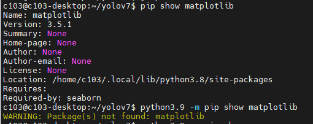

# 가상환경

### 원하는 버전 설치
```bash
sudo apt install python3.9 python3.9-venv python3.9-dev
```

### 가상환경 만들기
```bash
python -m venv [가상환경 이름]
```

### 가상환경 만든 후 기본 세팅
```bash
pip install --upgrade pip
```

### 가상환경 실행
```basah
// 실행
source [가상환경이름]/bin/activate

// 종료
deactivate
```


# Jetson Orin Nano에서 YOLO 모델 실행 시 파이썬 라이브러리 호환성 이슈

### 문제 인식 및 시행착오
웹캠을 이용해서 Yolo 모델을 실행 시 2~3초의 delay가 발생하는 문제가 생김.
    -> 원인을 못 찾고 있다가 동기가 원인에 대해 추론해줌.

다음은 문제 내용
- Yolo 모델을 실행 시 2 ~ 3초의 delay가 발생함.
- Yolo 모델을 실행 시 GPU를 사용하지 않고 CPU만 사용함

이를 통해 OpenCV with CUDA 를 세팅했음에도 불구하고 CUDA 가 적용되지 않는 것 같다고 추론을 함.

Yolo는 파이썬3.9를 사용, Jetson Orin Nano 에서는 파이썬3.8을 기본으로 사용되고 있는 상황.
    -> 그러다보니 OpenCV 4.5 버전과 CUDA 11.8 버전을 Jetson Orin Nano 에 세팅을 해두었고 파이썬3.8 버전에 적용되고, Yolo 관련 패키지들은 파이썬3.9와 호환됐음. 그러나 파이썬3.9를 설치할 때 각종 패키지들은 추천 버전으로 설치되었음.
    --> 파이썬3.9에서는 OpenCV 가 4.10 버전, CUDA is not find, pytorch 호환불가, numpy 호환불가 등 각종 호환성 이슈가 발생함

이를 해결하기 위해 python3.9의 OpenCV 4.10 을 삭제하고 OpenCV 4.5 로 재설치 이후 호환성 문제가 발생하는 패키지들을 OpenCV 4.5 CUDA 11.8, python3.9 와 호환성을 확인해가며 해당 버전의 패키지들을 각각 설치함.

python3.9 에 적용되는 패키지들을 설치해주기 위해 아래 명령어로 설치를 해줌.
```bash
python3.9 -m pip install [패키지 명==target_version]
```

파이썬3.8에 적용된 OpenCV with CUDA 패키지들의 버전과 파이썬3.9 와 호환되는 버전들을 체크하면서 설치함
```bash
# 해당 패키지 명의 버전을 확인하는 명령어
python -m pip show [패키지 명]
python3.9 -m pip show [패키지 명]
```


### 호환성 체크 참고 사이트
[pypi 공식사이트](https://pypi.org/search/?c=Programming+Language+%3A%3A+Python+%3A%3A+3.9&o=&q=scipy&page=1)
[pillow docs](https://pillow.readthedocs.io/en/stable/installation/platform-support.html)
[Pandas, Numpy 호환 관련 기술블로그](https://joinmycode.tistory.com/124)
