<div align="center">


# 프로젝트에 대한 정보
***

  ### 1. 프로젝트 제목

  스마트 쇼핑카트 “**담다**”

  ### 2. 로고 및 이미지 

  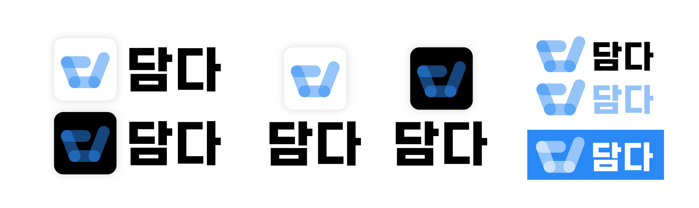


  ### 3. 프로젝트 정보 🗂

  딥러닝 객체 탐지 기술과 실내 측위 기술을 사용한 스마트 쇼핑카트

  `SSAFY 11th AIoT PJT`

  `개발기간: 24.07.08 ~ 24.08.16 (6주)`

  ### 4. 배포 주소 🌐

  개발버전 : 1. 0. 0

  백엔드 서버: https://i11c103.p.ssafy.io/

</div>
<div>


## 프로젝트 소개 🛒

  대형 마트 쇼핑 시 계산을 하기 위해 상품을 꺼내고 담는 **현재 쇼핑 프로세스의 불편함과 고객이 중간 상품 총액을 정확하게 알지 못하는 불편함을 해소하기 위한 스마트 쇼핑카트** 프로젝트

  ---

  이 프로젝트는 YOLO 객체 인식 기술을 활용하여 **상품을 쇼핑카트가 자동으로 인식**하고 쇼핑카트Qt 를 활용하여 **중간 총액을 고객에게 제공**한다.<br>
  UWB 모듈의 활용으로 사용자가 가지고 있는 태그를 따라가는 **트래킹 기능**을 제공한다.<br>
  쇼핑카트에 표시되는 QR코드 스캔으로 **간편 결제 기능**을 제공한다.<br>
  이후 **담다 앱을 통해 주변 마트 찾기, 가계부 기능, 성인 인증 등을 제공**한다.<br>

</div>


## 시작 가이드

### Requirements

  - Yolov7 ~

### Installation

```
git clone https://lab.ssafy.com/s11-webmobile3-sub2/S11P12C103.git
```


## 주요기능 🔍
<div align="center">

  ### 📌 쇼핑카트에서 QR 스캔으로 간편 결제 기능
    
    - 지금까지의 상품 리스트 정보를 담은 QR 코드 생성 (QT)
    - 사용자 App QR 코드 스캔 기능 구현
    - 사용자 App에서 구매 목록 리스트 저장
    - 자체 DB를 통해 인터넷이 불안정한 상황에서도 상품 인식 및 장바구니 정보 제공 가능

  ### 📌 쇼핑카트에 부착된 모니터로 편의성 증가
    
    - 상품 검색 기능을 통한 손쉬운 상품 찾기
    - 장바구니 화면을 통해 중간 총 상품 금액 파악 가능

  ### 📌 사용자 트래킹하는 쇼핑카트

    - 실내 측위 기술을 통해 사용자 위치 추적 및 트래킹 (UWB)
    - 장애물 또는 사용자가 접근 시 쇼핑카트 정지

  ### 📌 담다 앱

    - 근처 마트 찾기
    - 쇼핑카트의 상품정보가 담긴 QR코드를 인식하고 결제 기능
    - 결제 내역 및 가계부 기능
</div>


## 기술 스택 📖
<div align="center">
  ### Frontend

  
  
  

  ### Infrastructure

  
  
  
  

  ### AI

  
  

  ### Backend

  
  
  
  

  ### DB

  
  
  

  ### Embedded

  
  
  
  
  
    
</div>


## 아키텍쳐 📑

<div align="center">
  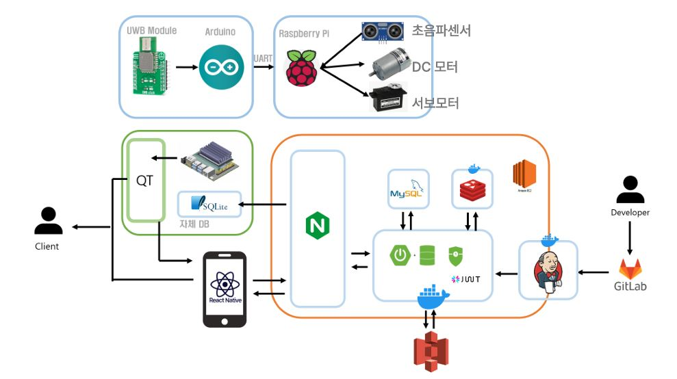
</div>

## ERD 

<div align="center">
  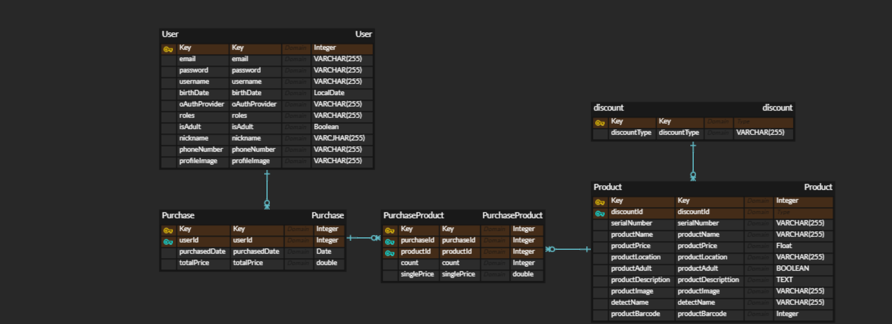
</div>

<div>


## 쇼핑카트

 
 

## 사용자 App 및 Qt 이미지
<div align="center">

### 사용자 App 📱

  ### 앱의 메인화면
  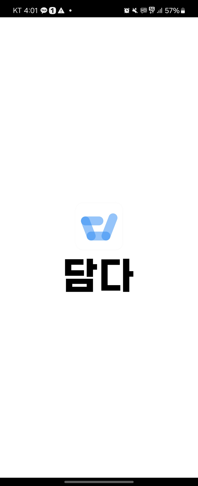

  

  

  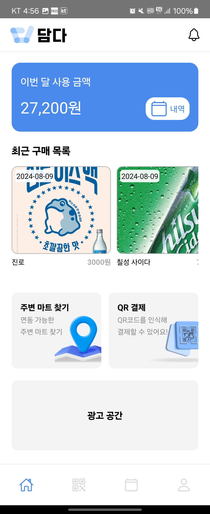

  

  ### 결제 화면
  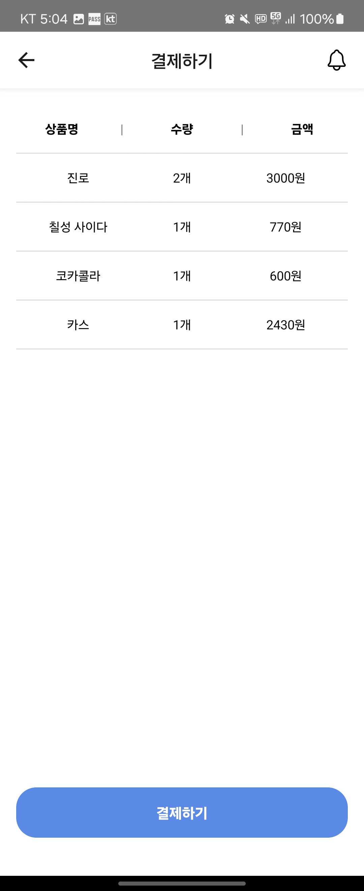

  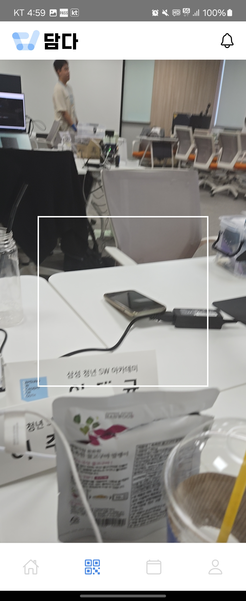

  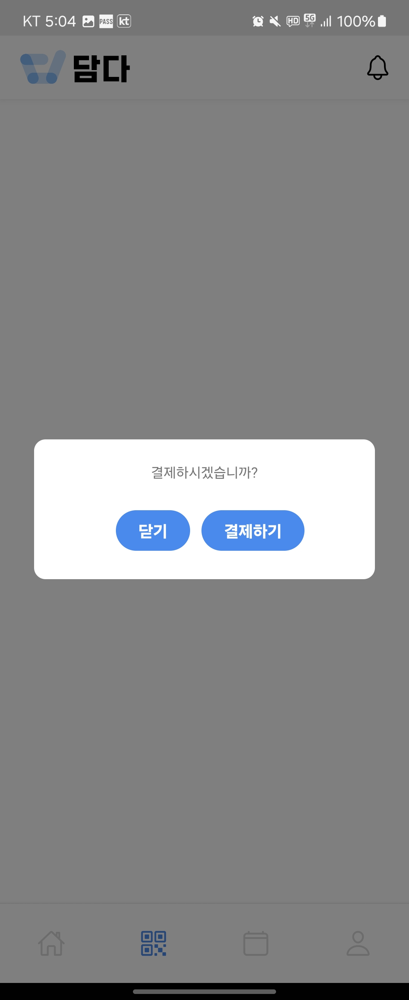

  ### 앱의 가계부 기능
  

  ### 주변마트찾기 기능
  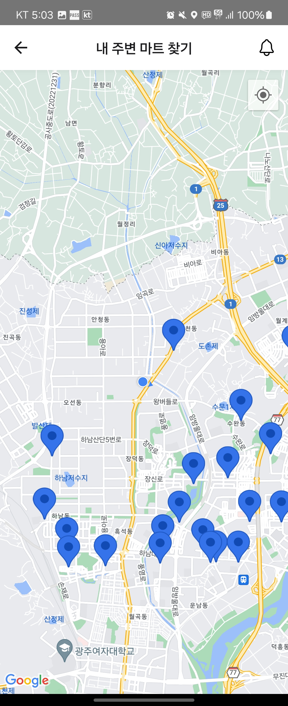

  ### 기타 기능
  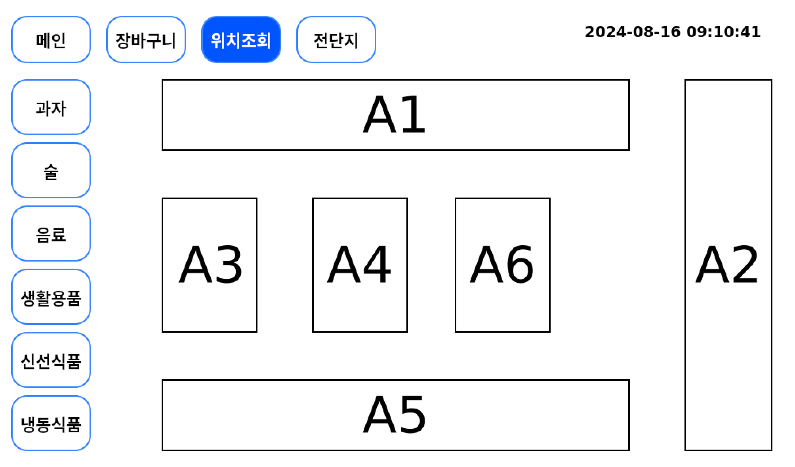

  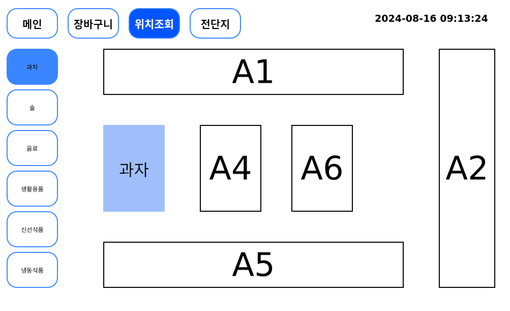

  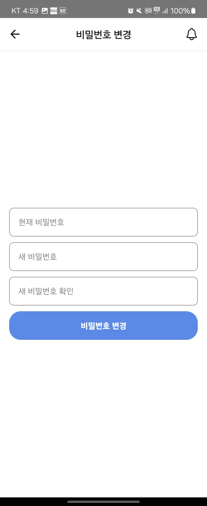

  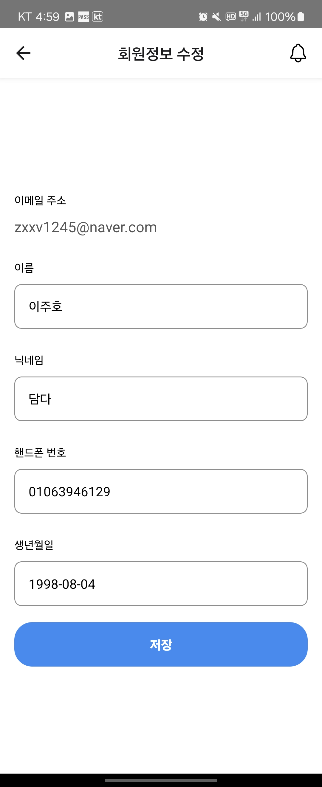

  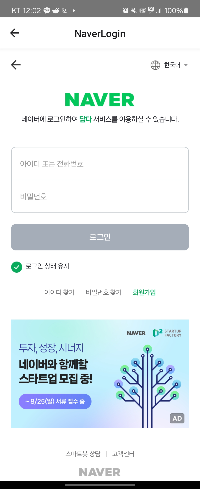

  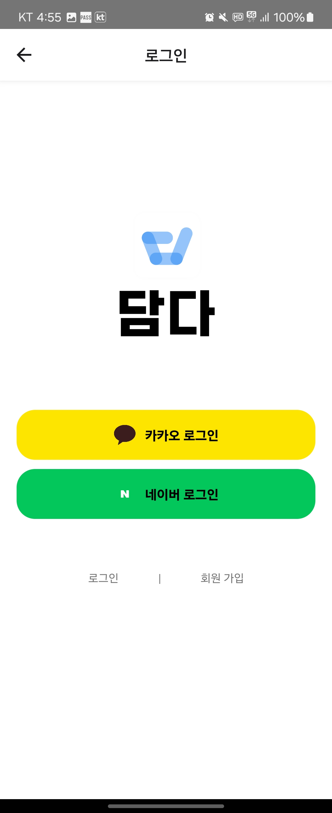

  

  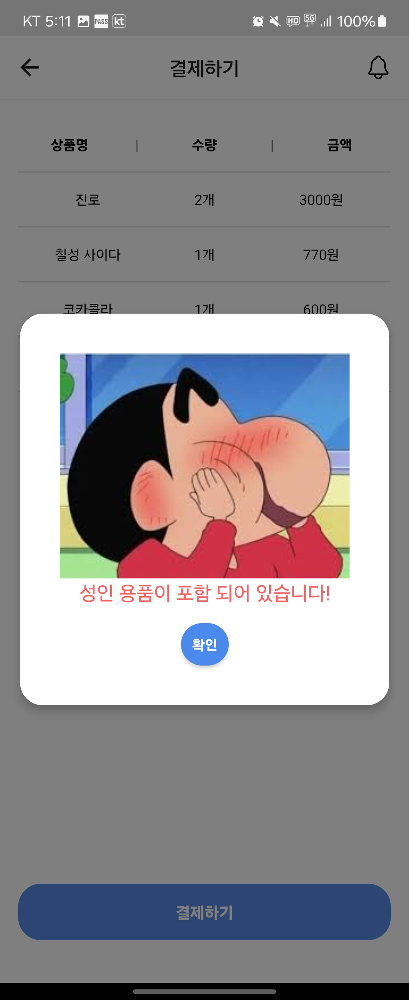

  ### 사용자 Qt 화면

  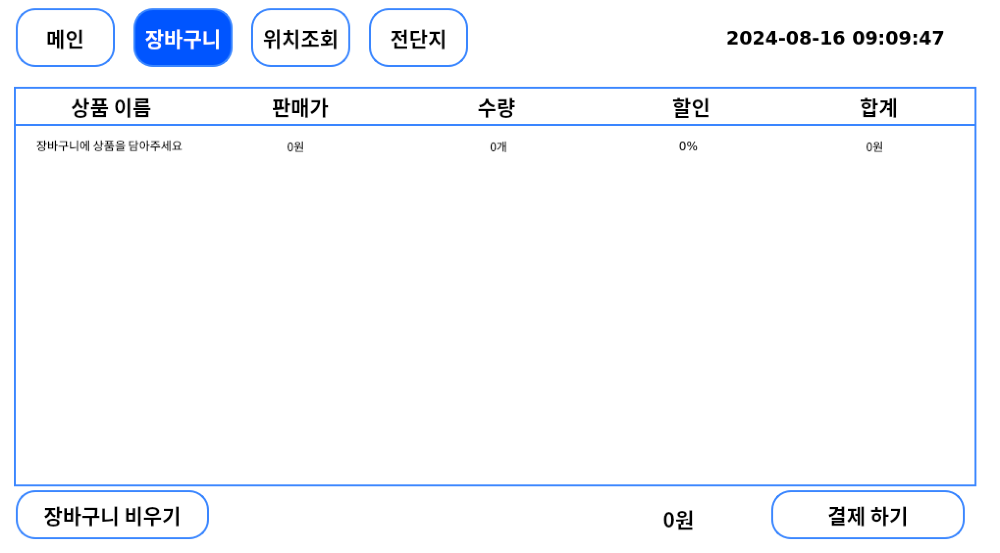

  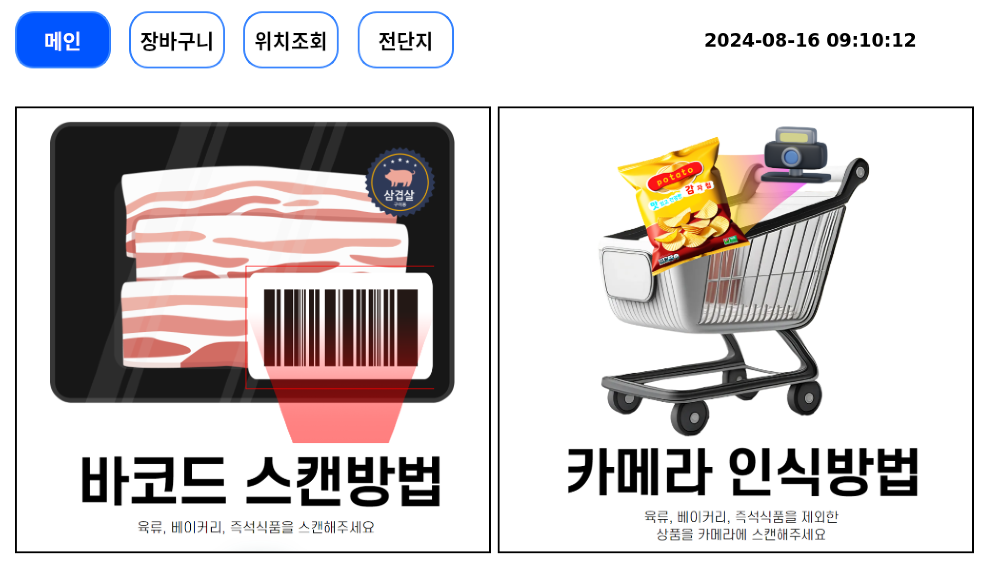

  

  

  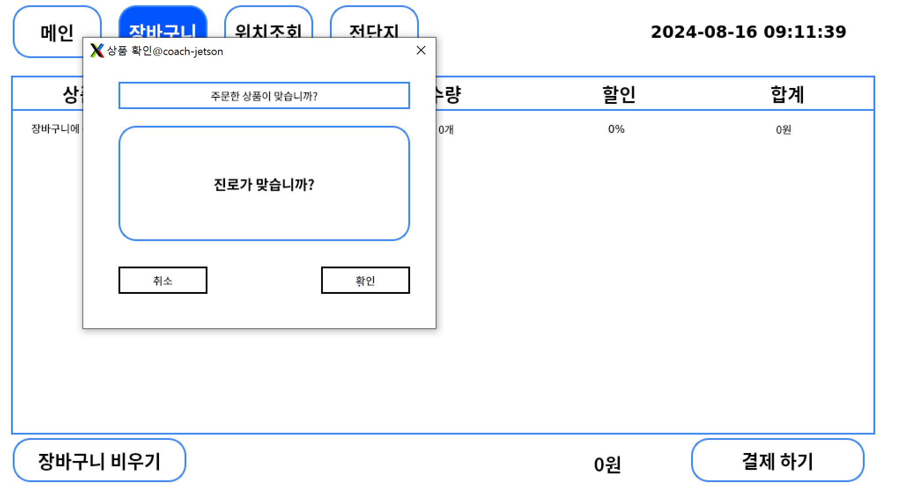

  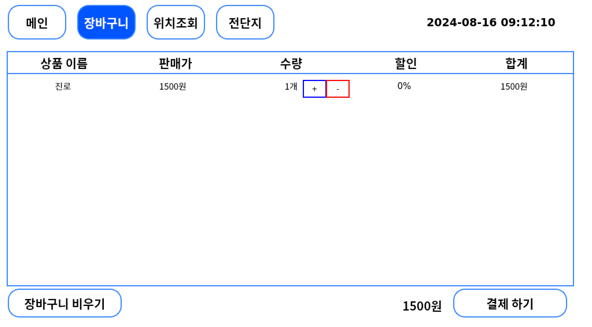

  

  ### 기존 쇼핑과 담다의 쇼핑의 차별점 👍

  | 비고 | 기존의 쇼핑 | 담다의 쇼핑 |
  |---|:---:|:---:|
  |상품 탐색|직접 탐색 또는 직원에게 문의|`쇼핑카트에서 위치 검색`|
  |이동 방식|사용자가 쇼핑카트를 끌고 다님|`쇼핑카트가 사용자를 따라다님`|
  |중간 정산|사용자가 직접 계산|`쇼핑카트가 현재까지 총액을 LCD에 표시`|
  |결제 방법|계산대에서 결제|`쇼핑카트에서 즉시 결제 가능`|
  |결제 이후|영수증 수령 후 사용자가 가계부 작성|`담다 앱에서 자동으로 가계부 기능 제공`|

</div>

  위 표를 통해 담다는 기존의 쇼핑 시스템과 비교하여 다음 다섯가지의 불편함을 해소할 수 있다.

  1. 쇼핑카트를 끌고 다니는 불편함 해소     
    - 쇼핑카트가 사용자를 자동으로 따라다니므로 직접 끌 필요가 없음.     

  2. 상품 탐색의 편리함     
    - 쇼핑카트의 위치 검색 기능을 통해 즉시 상품을 탐색할 수 있음.     

  3. 실시간 금액 확인      
    - 쇼핑 중에 쇼핑카트의 LCD 화면을 통해 현재까지 담긴 금액을 즉시 확인 가능.  

  4. 계산대 대기 시간 감소      
    - 계산대에서 기다리거나 상품을 다시 꺼내지 않아도 되어 쇼핑이 더욱 편리해짐.      

  5. 결제 내역 관리 및 가계부 정리 용이     
    - 결제 후에도 담다 앱을 통해 결제 내역을 관리하고 자동으로 가계부를 정리할 수 있음.     


## 시연 영상

<div align="center">

### 사용자 트래킹
[](https://youtu.be/Y9gdJKtYebw)
</div>

<div align="center">

### 사용자 트래킹 및 장애물 탐지
[](https://youtu.be/tbFH3UCyoNc)
</div>

<div align="center">

### 상품 바코드 인식
[](https://youtu.be/a96pfDbsXpI)
</div>

<div align="center">

### AI 상품 인식
[](https://youtu.be/chF4CFTtKdY)
</div>

<div align="center">

### 담다 앱 시연 영상
[](https://youtu.be/DVBAKg1N4L8)

</div>


## 팀 소개 👨‍👨‍👦 
  
<div align="center">

<table>
  <tbody>
    <tr>
      <td align="center">
        
        <br />
        <sub><b>EM 팀장 : 이택규</b></sub>
      </td>
      <td align="center">
        
        <br />
        <sub><b>EM 부팀장 : 윤의웅</b></sub>
      </td>
      <td align="center">
        
        <br />
        <sub><b>EM 팀원 : 이종하</b></sub>
      </td>
    </tr>
    <tr>
      <td>
        <ul>
          <li><strong>SSAFY 11th Embedded</strong></li>
          <li>PM & 3D Modeling</li>
          <li>UWB 사용자 트래킹 기능 구현</li>
        </ul>
      </td>
      <td>
        <ul>
          <li><strong>SSAFY 11th Embedded</strong></li>
          <li>YOLO 사물인식 기능 구현</li>
          <li>IPC 구현</li>
        </ul>
      </td>
      <td>
        <ul>
          <li><strong>SSAFY 11th Embedded</strong></li>
          <li>UWB 사용자 트래킹 기능 구현</li>
          <li>센서 및 모터 총괄 제어</li>
        </ul>
      </td>
    </tr>
    <tr>
      <td align="center">
        
        <br />
        <sub><b>EM 팀원 : 주현민</b></sub>
      </td>
      <td align="center">
        
        <br />
        <sub><b>BE 팀원 : 천요성</b></sub>
      </td>
      <td align="center">
        
        <br />
        <sub><b>FE 팀원 : 이주호</b></sub>
      </td>
    </tr>
    <tr>
      <td>
        <ul>
          <li><strong>SSAFY 11th Embedded</strong></li>
          <li>장애물 인지 기능 구현</li>
          <li>사용자 Qt 제작</li>
        </ul>
      </td>
      <td>
        <ul>
          <li><strong>SSAFY 11th Python</strong></li>
          <li>API 서버 개발 및 관리</li>
          <li>인프라 구축 담당</li>
        </ul>
      </td>
      <td>
        <ul>
          <li><strong>SSAFY 11th Python</strong></li>
          <li>사용자 App 제작</li>
          <li>Qt 보조</li>
        </ul>
      </td>
    </tr>
  </tbody>
</table>

</div>


출처: https://hulrud.tistory.com/3 [주독야독:티스토리]
